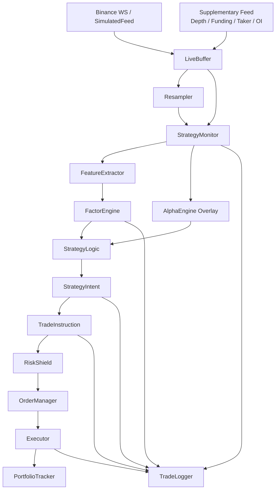
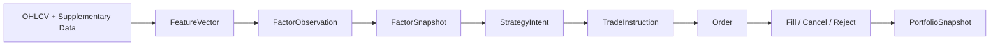
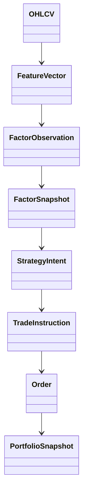
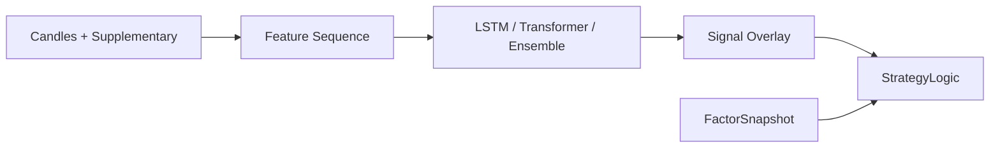
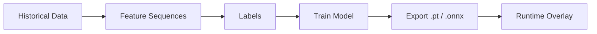

# 项目架构图

这份文档用中文说明当前仓库的主架构、核心对象链路、模块职责边界，以及在线运行和离线研究之间的关系。

当前项目已经不是 alpha-first 架构，而是 factor-first 架构。

主链路是：

`市场数据 -> 特征 -> 显式因子 -> 策略意图 -> 交易指令 -> 风控校验 -> 执行 -> 组合状态更新`

## 1. 一张总图



这张图表达的是两个关键点：

- 主决策来源是 `FactorEngine -> StrategyLogic`
- `AlphaEngine` 只作为 overlay 进入，不是唯一开仓依据

## 2. 运行时决策链



这个链条对应着逐层降歧义：

- `FeatureVector` 是原始市场状态的工程表达
- `FactorObservation` 是单个可解释因子
- `FactorSnapshot` 是某个时刻对一个标的的综合判断
- `StrategyIntent` 是人能看懂的交易决定
- `TradeInstruction` 是系统能执行的命令
- `Order` 是交易接口层的具体对象

## 3. 目录级模块地图

```text
main.py
|
+-- core/
|   +-- models.py                # 全局共享对象契约
|
+-- data/
|   +-- connector.py             # 实时行情与补充数据接入
|   +-- buffer.py                # 市场状态缓存
|   +-- resampler.py             # 多时间框架重采样
|   +-- sim_feed.py              # 纸交易模拟行情
|
+-- features/
|   +-- extractor.py             # 技术指标与序列特征提取
|
+-- strategy/
|   +-- factor_engine.py         # 因子生成层
|   +-- logic.py                 # 策略状态机与意图生成
|   +-- monitor.py               # 全链路调度器
|   +-- trade_tracker.py         # 自适应 Kelly 辅助
|
+-- models/
|   +-- inference.py             # rule-based / model overlay
|   +-- model_wrapper.py         # .pt / .onnx 加载
|   +-- lstm_model.py            # LSTM 结构定义
|   +-- transformer_model.py     # Transformer 结构定义
|   +-- train.py                 # 离线训练与导出
|   +-- icir_tracker.py          # ICIR 在线权重更新
|
+-- risk/
|   +-- risk_shield.py           # 下单前风控 + 运行时止损
|   +-- tracker.py               # 组合、PnL、回撤、风险指标
|
+-- execution/
|   +-- order_manager.py         # 订单生命周期管理
|   +-- sim_executor.py          # 纸交易执行
|   +-- roostoo_executor.py      # 比赛执行接口
|   +-- executor.py              # live executor 抽象
|   +-- trade_logger.py          # 结构化审计日志
|
+-- tests/                       # 围绕全链路行为的测试
|
+-- README.md                    # 英文总览
+-- ARCHITECTURE.md              # 中文架构图与说明
```

## 4. 各层输入与输出

| 模块 | 输入 | 输出 | 作用 |
| --- | --- | --- | --- |
| `data/connector.py` | 交易所 WS / REST | `OHLCV` 与补充字段 | 接市场数据 |
| `data/buffer.py` | K 线、depth、funding、taker、OI | 历史窗口与最新快照 | 持有运行时市场状态 |
| `data/resampler.py` | 1m candles | 5m / 15m / 1h candles | 给策略提供更稳定时间框架，并在启动时回填高周期上下文 |
| `features/extractor.py` | candles + supplementary | `FeatureVector` 或 feature sequence | 把市场状态数值化 |
| `strategy/factor_engine.py` | `FeatureVector` + 高周期上下文 | `FactorSnapshot` | 把特征翻译成可解释因子 |
| `models/inference.py` | strategy timeframe candles + aligned feature sequence | `Signal` | 作为可选 overlay，不能替代因子主策略 |
| `strategy/logic.py` | `FactorSnapshot` + portfolio + optional `Signal` | `StrategyIntent` / `TradeInstruction` | 产出交易决定，并维护 `FLAT -> LONG_PENDING -> HOLDING -> EXIT_PENDING` 状态机 |
| `risk/risk_shield.py` | `TradeInstruction -> Order` + portfolio | validated `Order` | 控制暴露、资金、回撤、止损 |
| `execution/order_manager.py` | validated `Order` | fill / cancel / callback | 统一订单生命周期，并把累计成交转换成增量成交 |
| `risk/tracker.py` | fills + price updates | `PortfolioSnapshot` | 维护组合单一真相源 |
| `execution/trade_logger.py` | 因子、意图、指令、订单、API 事件 | JSONL 日志 | 做审计与复盘 |

## 5. 核心对象关系图



当前项目最重要的工程改进，就是把这些对象明确分层了。

以前更像：

`feature -> alpha score -> order`

现在更像：

`feature -> factor snapshot -> strategy intent -> trade instruction -> order`

后者更容易解释、调试、回放和扩展。

## 6. StrategyMonitor 在做什么

`strategy/monitor.py` 是运行时总调度器。它本身不负责定义策略，而是负责按正确顺序调用各模块。

可以把它理解为下面这段伪代码：

```text
while new_closed_candle:
    update portfolio prices
    build resampled bars
    skip until warmup complete
    extract features
    evaluate explicit factors
    optionally score model overlay
    build strategy intent
    build trade instruction
    validate risk
    submit order
    check stops
    check circuit breaker
    log everything
```

它的价值不在于“复杂”，而在于把正确顺序钉死：

- 启动时先把 prefetched 1m K 线回放进 resampler，避免 5m / 15m / 1h 上下文冷启动
- 先解释市场
- 再形成决策
- 再转换成指令
- 再做风控
- 最后才执行

## 7. 因子层是整个系统的扩展中心

当前已经落地的因子包括：

- `trend_alignment`
- `momentum_impulse`
- `volume_confirmation`
- `liquidity_balance`
- `perp_crowding`
- `volatility_regime`

这些因子都在 `strategy/factor_engine.py` 里统一生成，然后进入一个 `FactorSnapshot`。

这意味着后面加 web3 数据时，最稳的接法不是：

- 直接改执行器
- 直接把模型换得更复杂
- 直接让外部信号跳过策略层去下单

而是：

`外部数据源 -> 归一化适配 -> 新的 FactorObservation -> FactorSnapshot -> StrategyLogic`

也就是说，这个项目未来最适合扩展的位置是因子层。

## 8. 模型在当前架构里的位置

模型层不再是主策略，而是辅助层。



这里要注意两点：

- `models/lstm_model.py` 和 `models/transformer_model.py` 只是结构定义
- 真正可推理的模型必须通过 `models/model_wrapper.py` 加载外部 `.pt` 或 `.onnx`
- overlay 现在使用和主策略同一套 primary timeframe candles，不再和 1m 原始流错位
- 补充特征历史也会先按主策略周期对齐，再送进模型

所以模型在架构里的准确角色是：

- 过滤器
- 置信度校准器
- 轻度仓位修正器

而不是：

- 唯一开仓裁决器
- 风控替代品
- 策略意图替代品

## 9. 风控和执行为什么独立

风控层和执行层被单独拆开是正确的，因为它们解决的是不同问题。

`risk/risk_shield.py` 解决的是：

- 这笔单子该不该放行
- 是否超暴露
- 是否没钱
- 是否触发日内回撤熔断
- 是否应该止损

`execution/order_manager.py` 和各 executor 解决的是：

- 单子怎么提交
- 是否成交
- 什么时候撤单
- 成交后怎么回调系统

如果把这两层混在一起，会出现两个后果：

- 策略无法只关注决策本身
- 执行细节会反过来污染研究逻辑

## 10. 在线运行闭环和离线训练闭环

### 在线闭环


### 离线闭环



这两个闭环共享一部分基础设施，但职责不一样：

- 在线闭环的目标是稳定交易
- 离线闭环的目标是研究和生成可选模型产物

## 11. 为什么现在这版架构更清晰

如果只看逻辑链条，我会把当前项目总结成下面三句话：

1. 数据层负责“看到市场发生了什么”
2. 因子层负责“解释这些现象意味着什么”
3. 策略层负责“把解释变成明确命令”

然后：

4. 风控层负责“决定这条命令能不能被执行”
5. 执行层负责“忠实完成命令并反馈结果”

这比直接从 `alpha score` 跳到 `order` 的系统更健壮，因为它具备：

- 可解释性
- 可审计性
- 可扩展性
- 更清晰的研究与生产边界

## 12. 后续最值得继续补强的点

如果继续往下演进，这个架构最自然的强化方向有三个：

- 把更多 web3 数据源接入因子层，而不是直接接到模型层
- 为每个因子建立独立 research card，记录 horizon、direction、magnitude、failure mode
- 把 `StrategyIntent` 和 `TradeInstruction` 日志进一步标准化成复盘报表

如果你只记一件事，就记这句：

这个项目现在的主干不是模型，而是 `FactorSnapshot -> StrategyIntent -> TradeInstruction` 这条显式决策链。
